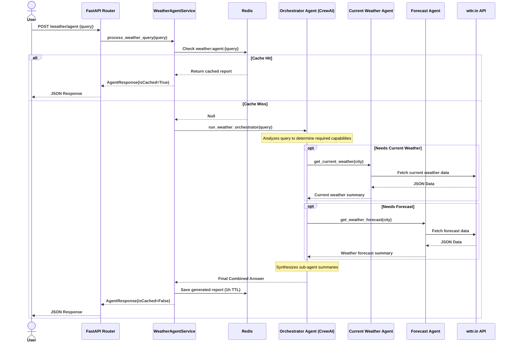

# Weather Assistant API

FastAPI service for current weather data and AI-generated weather summaries. Weather data is retrieved from [wttr.in](https://wttr.in), while summaries can be generated with CrewAI, LangGraph, AutoGen, or Google ADK.

> **🚀 New Feature: Model Context Protocol (MCP)**
> We now support MCP for seamless tool integration. Please refer to the [MCP Integration Guide (README-MCP.md)](README-MCP.md) for full details on running and querying the MCP server.

The API uses Redis as an optional cache and exposes OpenAPI documentation through FastAPI.

## Features

- Current weather by city
- Weather forecast up to 3 days by city
- AI weather summaries through four agent integrations
- **New:** AI Agent capability resolving application, subscription, and pricing FAQs via an embedded vector database similarity search over `weather.txt`.
- **Model Context Protocol (MCP)** server capability
- Redis caching for weather data and generated reports
- Health-check endpoint
- Pydantic request and response validation (null fields are excluded from JSON responses)
- CORS support for API clients
- Security headers for HTTP responses
- Structured logging and provider error handling
- Interactive Swagger UI and ReDoc documentation

## Requirements

- Python 3.11 or newer
- Redis 7 or newer for caching
- An OpenAI API key for CrewAI, LangGraph, and AutoGen
- A Google API key for Google ADK
- Langfuse credentials for optional observability
- Docker Desktop, if running Redis or the API container with Docker

## Local Setup

Create and activate a virtual environment in PowerShell:

```powershell
python -m venv .venv
.\.venv\Scripts\Activate.ps1
 source .venv/Scripts/activate (bash)

 $ python --version
Python 3.11
```

Install the dependencies:

```powershell
python -m pip install --upgrade pip
pip install -r requirements.txt
```

Create the local environment file:

```powershell
Copy-Item .env.example .env
```

Update `.env` with valid provider credentials:

```env
environment=development
CREWAI_TRACING_ENABLED=false
OPENAI_API_KEY=your-openai-api-key
OPENAI_API_MODEL=gpt-4o-mini
APP_NAME=Weather AI API
APP_VERSION=1.0.0
GOOGLE_API_KEY=your-google-api-key
GOOGLE_ADK_MODEL=gemini-3.5-flash-lite
WEATHER_API_URL=https://wttr.in
WEATHER_TIMEOUT_SECONDS=10
REDIS_URL=redis://localhost:6379/0
REDIS_CACHE_TTL_SECONDS=3600
LANGFUSE_PUBLIC_KEY=your-langfuse-public-key
LANGFUSE_SECRET_KEY=your-langfuse-secret-key
LANGFUSE_BASE_URL=https://us.cloud.langfuse.com
```

`OPENAI_API_KEY` is required in development because CrewAI, LangGraph, and AutoGen use OpenAI. `GOOGLE_API_KEY` is required only when using the Google ADK endpoint. Redis defaults to `redis://localhost:6379/0`; set `REDIS_URL` when Redis is running elsewhere.

### Langfuse observability

Langfuse tracing is optional. The values above enable tracing when both keys are valid:

```env
LANGFUSE_PUBLIC_KEY=your-langfuse-public-key
LANGFUSE_SECRET_KEY=your-langfuse-secret-key
```

When both keys are configured, the service records the provider, city, cache status, result, and provider errors. If the keys are omitted or Langfuse is unavailable, the API continues without tracing. Obtain keys from your Langfuse project at [langfuse.com](https://langfuse.com/).

## Start Redis

The Compose file starts Redis only:

```powershell
docker compose up -d redis
```

Stop Redis when it is no longer needed:

```powershell
docker compose down
```

The API can also run without Redis. In that case, requests bypass the cache and call the upstream weather or agent provider directly.

## Run the API

Start the development server from the project root:

```powershell
uvicorn app.main:app --reload
```

Alternatively:

```powershell
python app/main.py
```

The API is available at `http://localhost:8000`.

Documentation:

- Swagger UI: `http://localhost:8000/docs`
- ReDoc: `http://localhost:8000/redoc`

## Run with Docker

Build the image:

```powershell
docker build -t weather-assistant-api .
```

Run the API using the local environment file:

```powershell
docker run --rm --env-file .env -p 8000:8000 weather-assistant-api
```

When the API runs inside a container, `REDIS_URL` must point to a Redis host reachable from that container. For example, use `redis` when both services run on the same Docker network.

## Run Tests

Run the complete test suite from the project root:

```powershell
python -m pytest tests/test_api.py -v
```


The project pins AutoGen `0.7.5` and Langfuse `4.15.6` in `requirements.txt`.

## API Endpoints

All application endpoints use the `/api/v1` prefix. The `city` query parameter is required for weather endpoints.

### Health check

```http
GET /api/v1/health
```

Response:

```json
{
  "status": "ok"
}
```

### Current weather

```http
GET /api/v1/weather?city=Delhi
```

PowerShell:

```powershell
Invoke-RestMethod "http://localhost:8000/api/v1/weather?city=Delhi"
```

Example response for a fresh request:

```json
{
  "status": "success",
  "data": {
    "city": "Delhi",
    "temperature": "25",
    "feels_like": "26",
    "humidity": "60",
    "description": "Sunny",
    "wind_speed": "10"
  },
  "isCached": false
}
```

### Weather Forecast

```http
GET /api/v1/weather/forecast?city=Delhi
```

PowerShell:

```powershell
Invoke-RestMethod "http://localhost:8000/api/v1/weather/forecast?city=Delhi"
```

Example response:

```json
{
  "status": "success",
  "data": [
    {
      "date": "2026-09-26",
      "max_temp_c": "34",
      "min_temp_c": "25",
      "avg_temp_c": "29",
      "condition": "Sunny",
      "humidity": "50",
      "wind_speed_kmph": "12",
      "chance_of_rain": "0",
      "chance_of_snow": "0",
      "uv_index": "7"
    },
    {
      "date": "2026-09-27",
      "max_temp_c": "33",
      "min_temp_c": "24",
      "avg_temp_c": "28",
      "condition": "Partly cloudy",
      "humidity": "55",
      "wind_speed_kmph": "15",
      "chance_of_rain": "10",
      "chance_of_snow": "0",
      "uv_index": "6"
    }
  ],
  "isCached": false
}
```


### AI Weather Summaries

For intelligent, natural-language weather requests, the recommended approach is using the robust multi-agent POST endpoint. This endpoint uses an orchestrator to seamlessly route your query to either the current weather agent or the forecast agent (or both) based on the user's intent:

```http
POST /api/v1/weather/agent
Content-Type: application/json

{
  "query": "What is the current weather and 3-day forecast for London?"
}
```

The legacy GET endpoints are also available and return similar schemas:

```http
GET /api/v1/weather/crewai?city=What is the weather of Delhi
GET /api/v1/weather/langgraph?city=What is the temp of Delhi
GET /api/v1/weather/autogen?city=tell me weather of Delhi
GET /api/v1/weather/google-adk?city=weather of Delhi
```

PowerShell example (POST):

```powershell
Invoke-RestMethod -Uri "http://localhost:8000/api/v1/weather/agent" `
                  -Method Post `
                  -Body '{"query": "What is the weather of Delhi"}' `
                  -ContentType "application/json"
```

Example response:

```json
{
  "status": "success",
  "message": "The current weather in Delhi is ...",
  "isCached": false
}
```

Repeated requests for the exact same query will hit the Redis cache and return `"isCached": true`.

### Multi-Agent Orchestration Flow

The POST endpoint (`/weather/agent`) introduces an intelligent **CrewAI Orchestrator** that parses complex natural language queries and delegates work to specialized sub-agents. Here is the flow:



## Error Responses

- `404`: the weather provider could not find the requested city
- `422`: the `city` query parameter is missing or invalid
- `502`: the weather or AI provider is unavailable
- `500`: an unexpected application error occurred

Provider failures are logged and returned as safe API responses instead of exposing internal exceptions.
## Security

The API implements several HTTP security headers to protect against common web vulnerabilities:

- **Strict-Transport-Security (HSTS)**: Enforces secure (HTTPS) connections to the server (`max-age=31536000; includeSubDomains`).
- **X-Content-Type-Options**: Prevents the browser from interpreting files as a different MIME type to what is specified (`nosniff`).
- **X-Frame-Options**: Protects against clickjacking by denying the rendering of the API in a frame (`DENY`).
- **Content-Security-Policy (CSP)**: Helps detect and mitigate certain types of attacks, including Cross-Site Scripting (XSS) and data injection attacks (`default-src 'self'`).
- **Referrer-Policy**: Controls how much referrer information should be included with requests (`strict-origin-when-cross-origin`).

CORS is also configured to allow cross-origin requests. This can be restricted in production by configuring the `allow_origins` settings in `app/main.py`.


## Project Structure

```text
app/
├── agents/              # CrewAI, LangGraph, AutoGen, and Google ADK agents
├── route/               # FastAPI route handlers
├── schema/              # Pydantic request and response models
├── services/            # Weather service and service interface
├── tools/               # Agent weather tools
├── config.py            # Environment-backed settings
├── main.py              # FastAPI application
├── weather-mcp.py       # MCP (Model Context Protocol) server configuration
└── utils/               # Logging and Redis cache helpers
helm-config/             # Kubernetes Helm chart for Application
helm-mcp/                # Kubernetes Helm chart for MCP
tests/                   # API and service tests
```

## Kubernetes

The `helm-config` directory contains the Helm chart for deploying the API. It requires `OPENAI_API_KEY`, `GOOGLE_API_KEY`, and `REDIS_URL` as environment variables. Configure those values through your cluster's secret management before deploying.

Update the image repository, tag, ingress host, and resource settings in `helm-config/values.yaml` before deploying:

```powershell
helm upgrade --install weather-agent .\helm-config
```